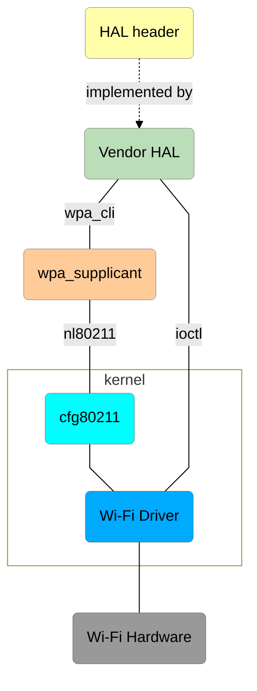
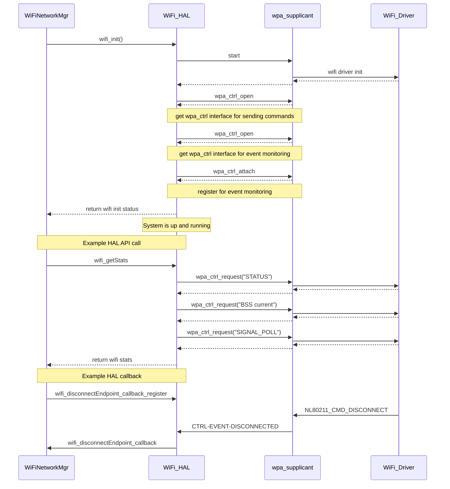

# RDK-V Wi-Fi HAL Documentation

## Version History

| Date | Author | Comment | Version |
| --- | --- | --- | --- |
| 07/14/23 || Initial Release | 0.1.0 |

## Acronyms

- `HAL` \- Hardware Abstraction Layer, may include some common components
- `RDK` \- Reference Design Kit for All Devices
- `RDK-V` \- Reference Design Kit for Video Devices
- `Wi-Fi` \- Wireless Radio Networking
- `AP` \- Wireless Access Point

## Description

The Hardware Abstraction Layer (HAL) is to abstract the RDK-V Wi-Fi requirements at a general level to allow platform independent control.

The picture below shows the interactions between `HAL`, `wpa_supplicant` and `Wi-Fi Driver`.



## Optional Components

Use of the following components is recommended but optional and up to the vendor's discretion.

- `wpa_supplicant` - user-space daemon software to authenticate the host to a wireless network and to control the wireless connection.
- `nl80211` - for userspace ←→ kernel communication to configure a cfg80211 device.
- `cfg80211` - Linux 802.11 configuration API

# Component Runtime Execution Requirements

It should be a statically loadable library. There should be one Wi-Fi HAL interface for the system, the lifetime of which shall exist throughout the lifetime of the process.

Failure to meet these requirements will likely result in undefined and unexpected behaviour.

## Initialization and Startup

Initialize the Wi-Fi HAL using `wifi_init()` before making any other call.

The kernel boot sequence is expected to start all dependencies of the Wi-Fi HAL.

## Threading Model

The Wi-Fi HAL is expected to be thread-safe. There is no restriction on the number of threads created.

## Process Model

A single instance of the Wi-Fi HAL is expected to exist, and only one instance will be initialized.

## Memory Model

The Wi-Fi HAL will own any memory that it creates. The client will own any memory that it creates. Exceptions to these rules can be specified in the API documentation.

## Power Management Requirements

There is no requirement for this component to participate in power management.

## Asynchronous Notification Model

The below asynchronous callback registration functions are defined and marked in the doxygen comments with token `@execution callback`

- `wifi_disconnectEndpoint_callback_register()` - for asynchronous notification on disconnect from an AP
- `wifi_connectEndpoint_callback_register()`- for asynchronous notification on connect to an AP

During callbacks, the client is responsible for the creation of any copies of data it might need unless otherwise specified in the API documentation.

## Blocking calls

None of the calls in the interface should block.

## Internal Error Handling

All the APIs define a list of return codes. Each API must be capable of returning all of the codes defined. The `UT`, if possible, will create cases
for the error codes to be exercised.

The Wi-Fi HAL is responsible for handling any system errors such as memory allocation failures and performing any checks such as array out-of-bounds checks and return-code checks before returning the return codes as defined in the `API` specification.

## Persistence Model

The Wi-Fi HAL configuration will be maintained by the upper layer.

# Non-functional requirements

The following non-functional requirements should be supported by the component.

## Logging and Debugging requirements

The component must log all error, warning and informational messages. This helps to debug/triage issues and understand the functional flow of the system.

Logging should be consistent across all components of the Wi-Fi HAL.

Logging should be defined with log levels as per Linux standard logging.

## Memory and Performance requirements

During idle and standby, memory and CPU utilization footprints should be minimal.

Refer to product specification for guidance on maximum CPU load-average and memory requirements.

## Quality Control

The vendor should endeavour to:

- have a zero-warning policy with regards to compilation of the Wi-Fi HAL code. All warnings should be enabled by default in the makefiles.
- run a static analysis tool like Coverity on the Wi-Fi HAL code.
- run a memory analysis tool like Valgrind on the Wi-Fi HAL code to identify leaks/corruptions.
- create Wi-Fi HAL tests with worst-case scenarios to assist investigations.

## Licensing

 Licensed under the Apache License, Version 2.0 (the "License").
 you may not use this file except in compliance with the License.

## Build Requirements

The source code should be built under Linux environment using `cmake`, `make`, `gcc`, etc. as required, and would normally be delivered as a library and source code.

## Variability Management

Ideally the source code should be delivered into Comcast/Sky git repositories and tagged based on the requirements for the project.
The vendor will follow the `Comcast federated delivery model` wherever possible.

Compile time flags `config` flags can control compilation:-

Example of this would be:-

`config` flags are encouraged, so this can be defined at the top-level compile time

```
#ifdef CONFIG_WIFI_V6
 .. do wifi v6
#else
.. no v6
#enidf
```

# Interface API Documentation

The interface is documented by Doxygen and will be included with this release.

## Theory of operation and key concepts

Covered as per "Description" sections in the API documentation.

## Sequence Diagram


