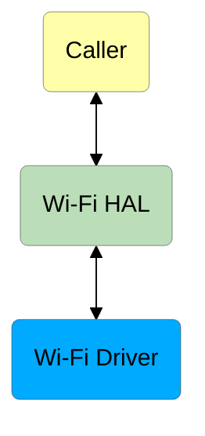
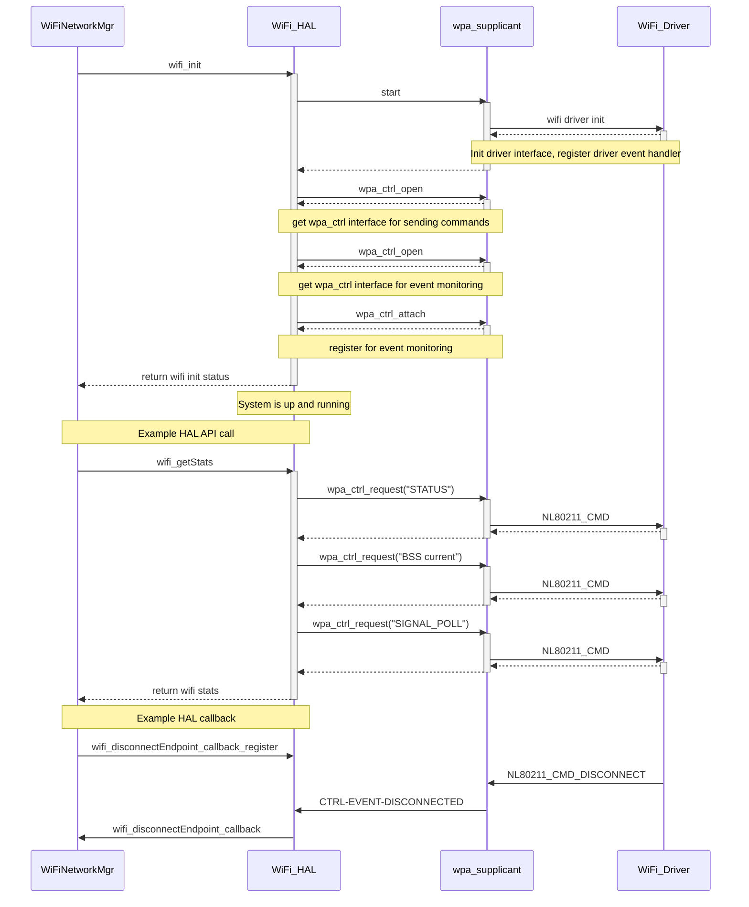

# RDK-V Wi-Fi HAL Documentation

## Version History

| Date (DD/MM/YY) | Comment | Version |
| --- | --- | --- |
| 14/07/23 | Initial Release | 0.1.0 |

## Table of Contents

- [RDK-V Wi-Fi HAL Documentation](#rdk-v-wi-fi-hal-documentation)
  - [Version History](#version-history)
  - [Table of Contents](#table-of-contents)
  - [Acronyms](#acronyms)
  - [Description](#description)
  - [Component Runtime Execution Requirements](#component-runtime-execution-requirements)
    - [Initialization and Startup](#initialization-and-startup)
    - [Threading Model](#threading-model)
    - [Process Model](#process-model)
    - [Memory Model](#memory-model)
    - [Power Management Requirements](#power-management-requirements)
    - [Asynchronous Notification Model](#asynchronous-notification-model)
    - [Blocking calls](#blocking-calls)
    - [Internal Error Handling](#internal-error-handling)
    - [Persistence Model](#persistence-model)
  - [Non-functional requirements](#non-functional-requirements)
    - [Logging and Debugging requirements](#logging-and-debugging-requirements)
    - [Memory and Performance requirements](#memory-and-performance-requirements)
    - [Quality Control](#quality-control)
    - [Licensing](#licensing)
    - [Build Requirements](#build-requirements)
    - [Variability Management](#variability-management)
    - [Platform or Product Customization](#platform-or-product-customization)
  - [Interface API Documentation](#interface-api-documentation)
    - [Theory of operation](#theory-of-operation)
    - [Diagrams](#diagrams)
      - [Operational call sequence](#operational-call-sequence)

## Acronyms

- `RDK-V` - Reference Design Kit for Video devices
- `Wi-Fi` - Wireless Radio Networking
- `HAL` - Hardware Abstraction Layer
- `API` - Application Programming Interface
- `AP` - Wireless Access Point

## Description

This interface is to abstract the RDK-V Wi-Fi requirements at a general level to allow platform independent control.

The picture below shows the interactions between `Caller`, `Wi-Fi HAL` and `Wi-Fi Driver`.

## Component Runtime Execution Requirements

These requirements ensure that the HAL executes correctly within the run-time environment that it will be used in.

### Initialization and Startup

`Caller` is expected to initialize Wi-Fi `HAL` by calling `wifi_init` before any other call. The kernel boot sequence is expected to start all dependencies of Wi-Fi `HAL`. When `wifi_uninit` is called, any resources allocated by `wifi_init` must be deallocated, such as termination of any internal `HAL` threads. There must be no resouce leaks if `wifi_init` and `wifi_uninit` are called alternately for an indeterminate number of times, as might occur where there are requirements to shut down Wi-Fi whenever ethernet is plugged in and to start up Wi-Fi whenever ethernet is plugged out.

### Threading Model

This interface is required to be thread-safe as it could be invoked from multiple `Caller` threads. There is no restriction on thread creation within the `HAL` but calling `wifi_uninit` must cause all created threads to be terminated.

### Process Model

There is only one `Caller` process that will initialize and use Wi-Fi `HAL`. The interface is expected to support a single instantiation with a single process.

### Memory Model

The Wi-Fi `HAL` will own any memory that it creates. The `Caller` will own any memory that it creates. Exceptions to these rules will be specified in the API documentation.

### Power Management Requirements

There is no requirement for this component to participate in power management.

### Asynchronous Notification Model

The below callback registration functions are defined by the HAL interface:

- `wifi_connectEndpoint_callback_register()`- to register a callback for asynchronous notification on connect to an AP
- `wifi_disconnectEndpoint_callback_register()` - to register a callback for asynchronous notification on disconnect from an AP

`HAL` must make these callbacks from a `HAL` thread. `Caller` must not make any calls to `HAL` from this thread.

During callbacks, `Caller` is responsible for the creation of any copies of data it might need unless otherwise specified in the API documentation.

### Blocking calls

None of the calls in the interface should block.

### Internal Error Handling

All APIs must return errors synchronously as a return argument. The interface is responsible for managing its internal errors.

### Persistence Model

Wi-Fi `HAL` is expected to persist the following configurations:
- Wi-Fi credentials for the last Wi-Fi network that was successfully connected to
- Wi-Fi roaming controls

These configurations must be applied on every `HAL` initialization. These configurations must persist across reboots and device software upgrades/downgrades. A warehouse/factory reset must clear these configurations.

## Non-functional requirements

The following non-functional requirements should be supported by the component.

### Logging and Debugging requirements

This component is required to log all ERROR, WARNING and INFO messages. DEBUG messages are to be disabled by default and enabled when needed.

### Memory and Performance requirements

This component is required to use minimal memory and CPU resources when the device is idle or in standby.

### Quality Control

* Static analysis is required to be performed. Our preferred tool is Coverity.
* Have a zero-warning policy with regards to compiling. All warnings are required to be treated as errors.
* Copyright validation is required to be performed, e.g.: Black duck, FossID.
* Use of memory analysis tools like Valgrind are encouraged, to identify leaks/corruptions.
* HAL Tests will endeavour to create worst-case scenarios to assist investigations.
* Improvements by any party to the testing suite are required to be fed back.

### Licensing

The Wi-Fi `HAL` header file is released under the Apache 2.0 license. The implementation may use any license compatible with the aforementioned header file.

### Build Requirements

The Wi-Fi `HAL` source code must build into a shared library named `libwifihal.so`.

### Variability Management

Any change to the interface must be reviewed and approved by component architects and owners.

### Platform or Product Customization

Wi-Fi HAL is not required to support platform-specific customizations.

## Interface API Documentation

`API` documentation is generated from doxygen comments in the header files.

### Theory of operation

After having called `wifi_init`, `Caller` can use this interface to get various Wi-Fi settings such as:

- Radio status (on/off)
- SSID name
- BSSID/Router MAC
- Regulatory domain
- Operating frequency/channel
- Operating channel bandwidth
- Radio standard (802.11 a / b / g / n / ac / ax / etc.)
- Security mode (WPA2-PSK / WPA2-EAP / etc.)
- Encryption type (AES / TKIP / etc.)
- Phy rate
- RSSI (received signal strength indicator)
- Noise
- Last data downlink rate
- Last data uplink rate
- Retransmissions
- Packets/Bytes/Errors sent/received
- Supported frequency bands
- Supported radio standards

and to perform actions such as:

- get scan results
- connect to a Wi-Fi network using password
- connect to a Wi-Fi network using WPS Push Button / WPS PIN
- disconnect from a Wi-Fi network
- cancel an in-progress WPS
- clear current network configuration
- set/get Wi-Fi roaming controls

The interface will provide notifications via callbacks regarding various events such as:

- Wi-Fi connection in progress
- Wi-Fi connected
- Wi-Fi disconnected
- Wi-Fi network not found
- Wi-Fi connection failed / invalid credentials / auth failed

### Diagrams

#### Operational call sequence

