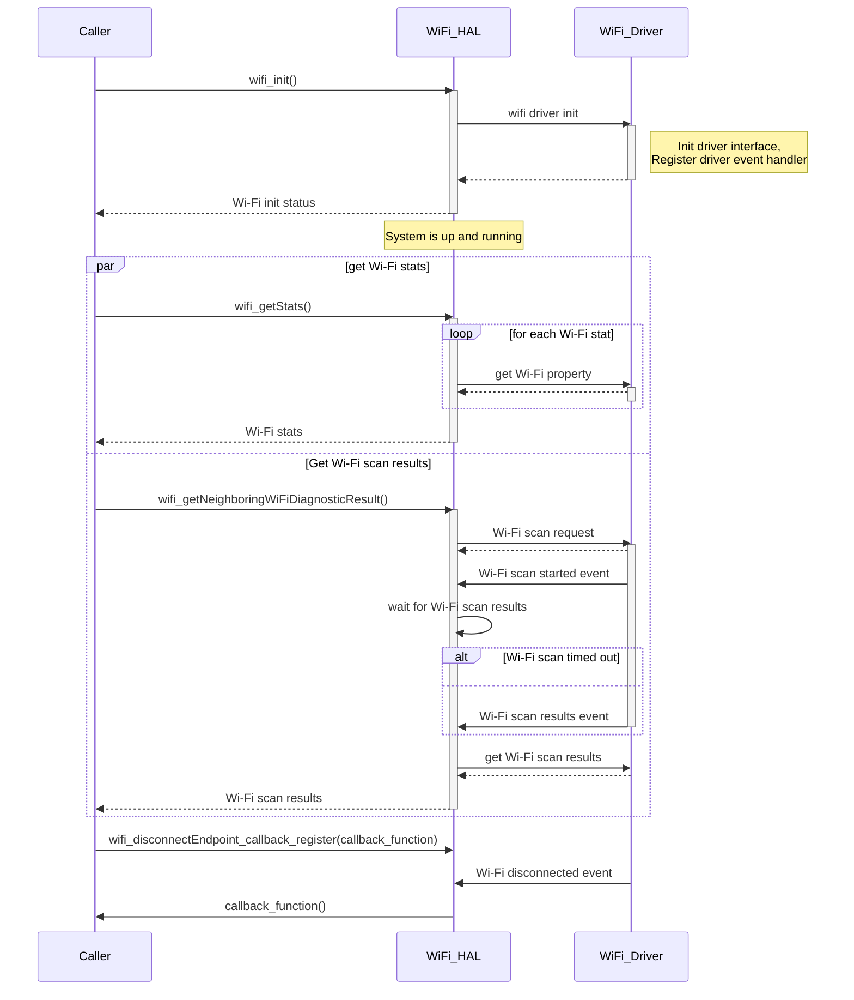

# RDK-V Wi-Fi HAL Documentation

## Version History

| Date (DD/MM/YY) | Comment | Version |
| --- | --- | --- |
| 14/07/23 | Initial Release | 1.0.0 |

## Table of Contents

- [RDK-V Wi-Fi HAL Documentation](#rdk-v-wi-fi-hal-documentation)
  - [Acronyms](#acronyms)
  - [Description](#description)
  - [Component Runtime Execution Requirements](#component-runtime-execution-requirements)
    - [Initialization and Startup](#initialization-and-startup)
    - [Threading Model](#threading-model)
    - [Process Model](#process-model)
    - [Memory Model](#memory-model)
    - [Power Management Requirements](#power-management-requirements)
    - [Asynchronous Notification Model](#asynchronous-notification-model)
    - [Blocking calls](#blocking-calls)
    - [Internal Error Handling](#internal-error-handling)
    - [Persistence Model](#persistence-model)
  - [Non-functional requirements](#non-functional-requirements)
    - [Logging and Debugging requirements](#logging-and-debugging-requirements)
    - [Memory and Performance requirements](#memory-and-performance-requirements)
    - [Quality Control](#quality-control)
    - [Licensing](#licensing)
    - [Build Requirements](#build-requirements)
    - [Variability Management](#variability-management)
    - [Platform or Product Customization](#platform-or-product-customization)
  - [Interface API Documentation](#interface-api-documentation)
    - [Theory of operation](#theory-of-operation)
    - [Diagrams](#diagrams)
      - [Operational call sequences](#operational-call-sequences)
        - [Wi-Fi init](#wi-fi-init)
        - [Get Wi-Fi stats](#get-wi-fi-stats)
        - [Get Wi-Fi scan results](#get-wi-fi-scan-results)
        - [Wi-Fi disconnected event](#wi-fi-disconnected-event)

## Acronyms

- `RDK-V` - Reference Design Kit for Video devices
- `Wi-Fi` - Wireless Radio Networking
- `HAL` - Hardware Abstraction Layer
- `API` - Application Programming Interface
- `Caller` - Any user of the interface via the `API`s
- `AP` - Wireless Access Point
- `SSID` - Service Set IDentifier
- `BSSID` - Basic Service Set IDentifier
- `MAC` - Media Access Control
- `WEP` - Wired Equivalent Privacy
- `WPA2` - Wi-Fi Protected Access 2
- `WPA3` - Wi-Fi Protected Access 3
- `PSK` - Pre-Shared Key
- `EAP` - Extensible Authentication Protocol
- `802.11` - Set of standards that define communication for Wireless Local Area Networks
- `AES` - Advanced Encryption Standard
- `TKIP` - Temporal Key Integrity Protocol
- `PHY` - Physical Layer
- `RSSI` - Received Signal Strength Indicator
- `WPS` - Wi-Fi Protected Setup

## Description

This interface is to abstract the `RDK-V` `Wi-Fi` `HAL` requirements at a general level to allow platform independent control.

The picture below shows the interactions between `Caller`, `Wi-Fi` `HAL` and `Wi-Fi` Driver.

## Component Runtime Execution Requirements

These requirements ensure that the `HAL` executes correctly within the run-time environment that it will be used in.

### Initialization and Startup

`Caller` is required to initialize `Wi-Fi` `HAL` by calling `wifi_init()` before any other call. The kernel boot sequence is expected to start all dependencies of `Wi-Fi` `HAL`. When `wifi_uninit()` is called, any resources allocated by `wifi_init()` must be deallocated, such as termination of any internal `HAL` threads. There must be no resouce leaks if `wifi_init()` and `wifi_uninit()` are called alternately for an indeterminate number of times, as might occur where there are requirements to shut down `Wi-Fi` whenever ethernet is plugged in and to start up `Wi-Fi` whenever ethernet is plugged out.

### Threading Model

This interface is required to be thread-safe as it could be invoked from multiple `caller` threads. There is no restriction on thread creation within the `HAL` but calling `wifi_uninit()` must cause all created threads to be terminated.

### Process Model

The interface is expected to support a single instantiation with a single process. Results are undefined if `Wi-Fi` `HAL` is instantiated by more than one process.

### Memory Model

The `Wi-Fi` `HAL` will own any memory that it creates. The `Caller` will own any memory that it creates. Exceptions to these rules are the `API`s `wifi_getNeighboringWiFiDiagnosticResult()` and `wifi_getSpecificSSIDInfo()` that allocate and return memory to the `caller` who must deallocate this memory.

### Power Management Requirements

This interface is not required to be involved in power management.

### Asynchronous Notification Model

The below callback registration functions are defined by the `HAL` interface:

- `wifi_connectEndpoint_callback_register()`
- `wifi_disconnectEndpoint_callback_register()`

The below events are notified via the callback registered using `wifi_connectEndpoint_callback_register()`:
- `Wi-Fi` connection in progress
- `Wi-Fi` connected
- `Wi-Fi` connection failed / invalid credentials / auth failed

The below events are notified via the callback registered using `wifi_disconnectEndpoint_callback_register()`:
- `Wi-Fi` disconnected
- `Wi-Fi` network not found / `SSID` changed

Callback functions must originate in a thread that's separate from `caller` context(s). `Caller` will not make any `HAL` calls in the context of these callbacks.

### Blocking calls

This interface has 3 blocking calls, namely `wifi_getNeighboringWiFiDiagnosticResult()`, `wifi_waitForScanResults()` and `wifi_getSpecificSSIDInfo()`, which will block until scan results are obtained or a timeout occurs, whichever happens earlier.

### Internal Error Handling

All `API`s must return errors synchronously as a return argument. The interface is responsible for managing its internal errors.

### Persistence Model

`Wi-Fi` `HAL` is expected to persist the following configurations:
- `Wi-Fi` roaming controls
- `Wi-Fi` configuration parameters 

<!-- @todo Wi-Fi HAL should not be responsible for persisting Wi-Fi roaming controls. This should be done from outside the Wi-Fi HAL. In next phase -->

These configurations must persist across reboots and device software upgrades/downgrades. A warehouse/factory reset must clear these configurations.

## Non-functional requirements

The following non-functional requirements should be supported by the component:

### Logging and Debugging requirements

<!-- @todo Provide info on Wi-Fi HAL's internal architecture to Malcom so that Malcolm can get back on what to do about the below. -->

This component is required to log all ERROR, WARNING and INFO messages. DEBUG messages are to be disabled by default and enabled when needed.

### Memory and Performance requirements

This interface is required to not cause excessive memory and CPU utilization.

### Quality Control

* Static analysis is required to be performed. Our preferred tool is Coverity.
* Have a zero-warning policy with regards to compiling. All warnings are required to be treated as errors.
* Copyright validation is required to be performed, e.g.: Black duck, FossID.
* Use of memory analysis tools like Valgrind are encouraged, to identify leaks/corruptions.
* `HAL` Tests will endeavour to create worst-case scenarios to assist investigations.
* Improvements by any party to the testing suite are required to be fed back.

### Licensing

This interface is required to be released under the Apache License 2.0.

### Build Requirements

This interface is required to build into shared library. The shared library must be named libwifihal.so. The building mechanism must be independent of Yocto.

### Variability Management

Any change to the interface must be reviewed and approved by component architects and owners.

### Platform or Product Customization

`Wi-Fi` `HAL` must not have any product-specific dependencies or customizations.

## Interface API Documentation

`API` documentation is generated from doxygen comments in the header files.

### Theory of operation

`Caller` can use the `Wi-Fi` `HAL` to get various `Wi-Fi` settings such as:

- Radio status (on/off)
- `SSID` name
- `BSSID` / `Wi-Fi` Router `MAC` address
- Regulatory domain
- Operating frequency/channel
- Operating channel bandwidth
- Radio standard (`802.11` a / b / g / n / ac / ax / etc.)
- Security mode (Open, `WEP`, `WPA2`-`PSK` / `WPA2`-`EAP` / `WPA3` / etc.)
- Encryption type (`AES` / `TKIP` / etc.)
- `PHY` rate
- `RSSI`
- Noise
- Last data downlink rate
- Last data uplink rate
- Retransmissions
- Packets/Bytes/Errors sent/received
- Supported frequency bands
- Supported radio standards

and to perform actions such as:

- Get `Wi-Fi` scan results
- Connect to a `Wi-Fi` network using password
- Connect to a `Wi-Fi` network using `WPS` Push Button / `WPS` PIN
- Disconnect from a `Wi-Fi` network
- Cancel an in-progress `WPS`
- Clear current `Wi-Fi` network configuration
- Get/Set `Wi-Fi` roaming controls

### Diagrams

#### Operational call sequences

